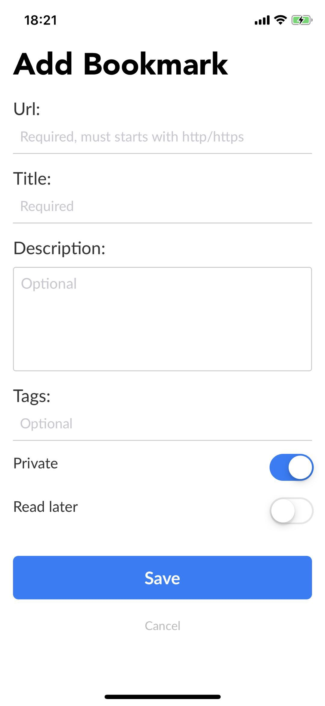

# JSBox Pinboard

## 功能

### 1.0

新增功能：

1. 保存分享的链接至 Pinboard
2. 查看所有的书签
3. 查询书签（支持通过标签）

### 安装及使用

- 安装：[点击安装](https://github.com/VVangChen/jsbox-pinboard/raw/master/.output/jsbox-pinboard.box)
- 使用：需要先设置 API Token，[获取 Token](https://pinboard.in/settings/password)

## 预览

